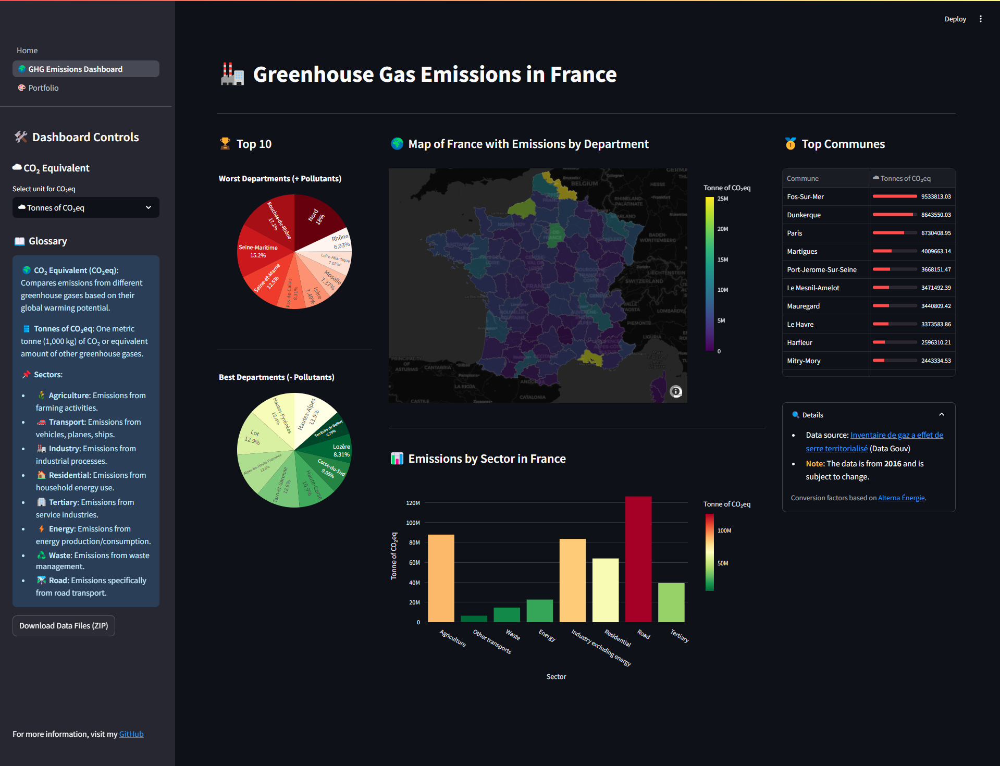
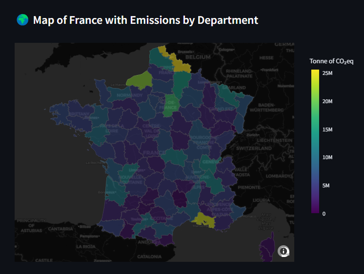
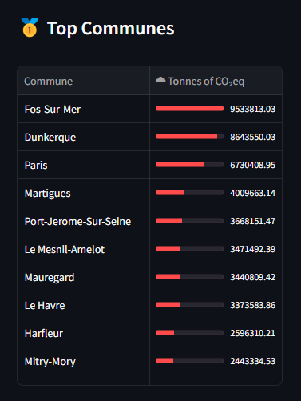
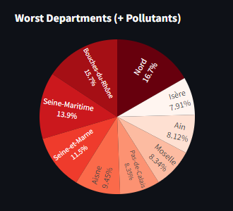

# 🏭 GHG Emissions Dashboard - France

Welcome to the interactive dashboard for greenhouse gas (GHG) emissions in France! 🌍 <br><br>

This project uses **Streamlit** and **Plotly** to visualize emissions by sector and department, with interactive options to explore data in various CO₂ equivalent units.

## 📋 Features

- 😶‍🌫️ **Emissions Visualization**: A map of France with a choropleth of emissions by department.
- 🏆 **Top Communes and Departments**: Display of the most and least polluting departments.
- 📊 **Emissions by Sector**: Detailed charts showing emissions by various sectors (agriculture, transport, industry, etc.).
- 💾 **Data Download**: Download raw data files in CSV format.



## 🚀 Installation and Setup

### Prerequisites

Ensure you have **Python 3.8+** and **Streamlit** installed.

### Installation

1. Clone the GitHub repository:

   ```bash
   git clone https://github.com/ktzkvin/GHG-Emissions-Dashboard.git
   cd GHG-Emissions-Dashboard

2. Install the required dependencies:

   ```bash
   pip install -r requirements.txt

### Running the Application

1. Run the application using **Streamlit**:

   ```bash
   streamlit run dashboard.py

2. Access the dashboard via your browser at: `http://localhost:8501`.

## 📊 Example Visualizations

### Emissions Map by Department

Visualize the total GHG emissions by department across an interactive map.



### Top Polluting Communes and Departments

Discover the Communes and the Departments with the highest and lowest CO₂eq emissions.

&emsp;&emsp;&emsp;&emsp;&emsp;&emsp;&emsp;&emsp;&emsp;&emsp;&emsp;&emsp;&emsp;
&emsp;&emsp;&emsp;&emsp;&emsp;&emsp;&emsp;&emsp;&emsp;


### Emissions by Sector

An interactive bar chart to explore emissions across different sectors.

&emsp;[Sector Emissions](screenshots/sector_emissions.png)

## 🧩 Technologies Used

- **Streamlit** for the interactive user interface.
- **Plotly** for interactive charts.
- **Pandas** for data manipulation.

## 💡 Notes

- The data is based on the [2016 territorial greenhouse gas inventory](https://www.data.gouv.fr/fr/datasets/inventaire-de-gaz-a-effet-de-serre-territorialise/). The data is subject to updates.
- CO₂eq conversion factors are sourced from reliable sources like [Alterna Énergie](https://www.alterna-energie.fr/blog-article/1-tonne-de-co2-equivalent-comprendre-cet-indice#:~:text=Le%20terme%20%E2%80%9CCO%E2%82%82%20%C3%A9quivalent%E2%80%9D%20(,%2C%20protoxyde%20d\'azote%E2%80%A6)).

---
